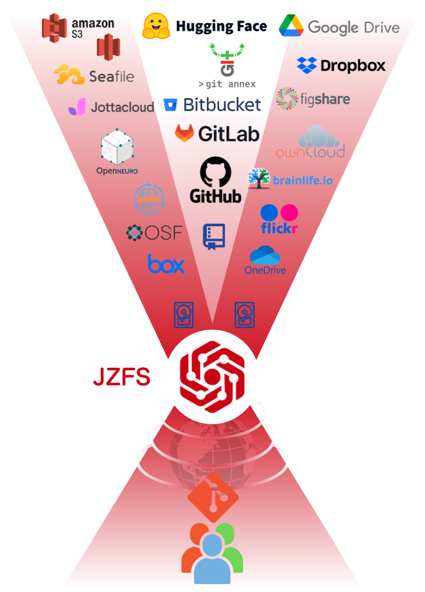
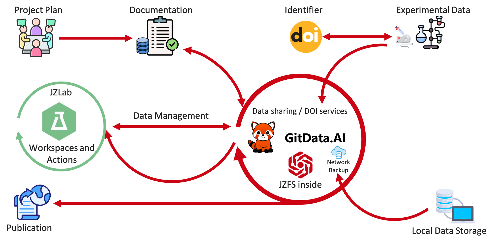
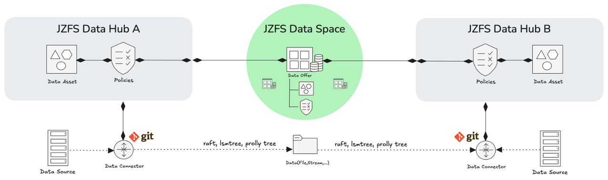

<p align="center">
  <picture>
    <source media="(prefers-color-scheme: light)" srcset="https://github.com/GitDataAI/jzfs/blob/main/docs/jzfs-logo-words.png?raw=true">
    <source media="(prefers-color-scheme: dark)" srcset="https://github.com/GitDataAI/jzfs/blob/main/docs/jzfs-logo-words-light.png?raw=true">
    
  </picture>
</p>
<h2 align="center">Git Based & Version Control & Joint Management <br/>for code, data, model and their relationship</h2>

>  Delivers distributed data management system that keeps track of your data  from code to PB scale dataset and  ensures reproducibility.

<div align="center">
<h3 align="center">
  <a href="https://gitdata.ai">JZFS Cloud</a> |
  <a href="https://gitdata.ai/">User Guide</a> |
  <a href="https://gitdata.ai/">API Docs</a> |
  <a href="https://github.com/GitDataAI/jzfs">Roadmap 2025</a>
</h3>

<a href="https://github.com/GitDataAI/jzfs/releases/latest">

</a>
<a href="https://github.com/GitDataAI/jzfs/releases/latest">

</a>
<a href="https://hub.docker.com/r/gitdatateam/jzfs/">

</a>
<a href="https://github.com/GitDataAI/jzfs/actions/workflows/flow.yml">

</a>
<a href="https://codecov.io/gh/GitDataAI/jzfs">

</a>
<a href="https://github.com/GitDataAI/jzfs/blob/main/LICENSE">

</a>

<br/>

<a href="https://gitdata.ai/slack">

</a>
<a href="https://x.com/GitDataAI">

</a>
<a href="https://www.linkedin.com/company/gitdataai">

</a>
</div>

## Introduction

**JZFS** is an open-source, cloud-native version control filesystem based on Git protocol for data management and publication with a command line interface and a Python API.   With JZFS, you can version control arbitrarily large data, share or consume data, record your data’s provenance, and work computationally reproducible.

JZFS adapts principles of open-source software development and distribution to address the technical challenges of data management, data sharing, and digital provenance collection across the life cycle of digital objects.


Compared with code in software development, data tend not to be as precisely
identified because data versioning is rarely or only coarsely practiced. Scientific computation
is not reproducible enough, because data provenance, the information of how a digital file
came to be, is often incomplete and rarely automatically captured. Last but not least, in
the absence of standardized data packages, there is no uniform way to declare actionable
data dependencies and derivative relationships between inputs and outputs of a computation. JZFS aims to solve these issues by providing streamlined, transparent management
of code, data, computing environments, and their relationship.

### Current Status and Roadmap

JZFS is still in the early development stages and is considered **incubating**. There is no commitment to ongoing maintenance or development. As the project evolves, this may change in the future. Therefore, we encourage you to explore, experiment, and contribute to JZFS, but do not attempt to use it in production.

The immediate next steps for the project are to fill obvious gaps, such as implementing error handling, removing panics throughout the codebase, supporting additional data types, and writing documentation. After that, development will be based on feedback and contributions.

JZFS's long-term goal is to build data ecosystems that enable new innovations.


### Reserach Data Management

JZFS is based on Git with extend capabilities, especially with respect to managing large files.

JZFS is a data management software designed to support the various stages
of the development of digital objects.

Importantly, JZFS can be seen as an overlay on top of existing data
structures and services: Tracking files does not change the files themselves or the location from which they can
be retrieved by data processing tools.

JZFS is used to collect
all experimental metadata about the complete timeline of longitudinal and multimodal animal experiments,
including MRI, histology, electrophysiology, and behavior.


Project planning and experimental details are recorded in an in-house relational cloud-based database.

A key element for both the database and the data storage is the
identifier, the study ID for each animal, used in a standardized fle name structure to make the data findable.

Te directory structure for the raw data follows the permit of performing animal experiments. Te data for a
specific project is organized following the YODA principles (https://handbook.datalad.org/en/latest/basics/101-127-yoda.html), which is compatible with existing standards, e.g., the BIDS structure.

In preparation for publication and to facilitate
data reproducibility, the experimental raw and processed data is made publicly available on GitData.AI.

JZFS is used as the central data management tool (Fig. above) and for version control: It keeps track of which
files were modified, when, and by whom, and provides the ability to restore previous states. To this end, JZFS
is agnostic of the data type and provides a unified interface for managing code and data files.


### DataHub
Our central use case is the DataHub(Like Github, buf for Data),which essentially consists of a Git version control for data and a Git collaboration for data.

In the JZFS DataHub model, each node maintains a copy of the files and all of the history of each file.
Thus, the node can make reads and writes of all past revisions offline.
When a node wants to share changes, it specifies a "remote".
The node can then send its state to that node, called "push", or receive new state from it, called "pull".
Writes are organized on branches.
Git is designed to compute differences between versions quickly.
Generally, Git relies on human action to share and merge changes.

Fault tolerance and trustless-ness are achieved via the separation of remotes from individual nodes.
Each node in the network is maintaining it's own copy, its history and coordinating via one or many remotes.
If a remote you trust gets corrupted, you have the ability to roll back to a previous good state and switch to a new remote.
Even if you lose your copy you can rely on other nodes' copies to restore from.

This enables us to create transparency across internal and external data.

It forms the basis for a new way of practicing data exchange and contract design for distributed data sources.

It is crucial that data exchange works both within the company and in individually controllable data networks (data space).

### Data Space
JZFS data space consists of so-called “DataHubs”  like one or many remotes in Git, which are virtual data nodes for sharing data and building data networks.
A single DataHub manages various data connections and can join together with other hubs to form a network through targeted synchronization.
Based on data contracts mapped in the network, data can be released to other participants, enabling efficient data exchange.




JZFS offers git for data technology for exchanging data in data hub and data space.

The added value is clear: simple, transparent data management combined with intuitive linking and sharing of data in decentralized networks – data space.
This enables secure, trustworthy data exchange across organizational boundaries.


### Deploy
```bash
docker compose up -d
```
### License

This project is licensed under the [MIT License].

[MIT License]: LICENSE

### Contribution

Unless you explicitly state otherwise, any contribution intentionally submitted for inclusion in GitDataAi by you, Please refer to [Contribution Guidelines](Contributing.md), shall be licensed as MIT, without any additional terms or conditions.


<!-- ALL-CONTRIBUTORS-BADGE:START - Do not remove or modify this section -->
[](#contributors-)
<!-- ALL-CONTRIBUTORS-BADGE:END -->
## Contributors ✨

Thanks goes to these wonderful people ([emoji key](https://allcontributors.org/docs/en/emoji-key)):
<!-- ALL-CONTRIBUTORS-LIST:START - Do not remove or modify this section -->
<!-- prettier-ignore-start -->
<!-- markdownlint-disable -->
<table>
  <tbody>
    <tr>
      <td align="center" valign="top" width="14.28%"><a href="https://github.com/taoshengshi"><br /><sub><b>taoshengshi</b></sub></a><br /><a href="#content-taoshengshi" title="Content">🖋</a></td>
    </tr>
  </tbody>
</table>

<!-- markdownlint-restore -->
<!-- prettier-ignore-end -->

<!-- ALL-CONTRIBUTORS-LIST:END -->

<!-- ALL-CONTRIBUTORS-LIST:START - Do not remove or modify this section -->
<!-- prettier-ignore-start -->
<!-- markdownlint-disable -->
<!-- markdownlint-restore -->
<!-- prettier-ignore-end -->
<!-- ALL-CONTRIBUTORS-LIST:END -->

This project follows the [all-contributors](https://github.com/all-contributors/all-contributors) specification. Contributions of any kind welcome!