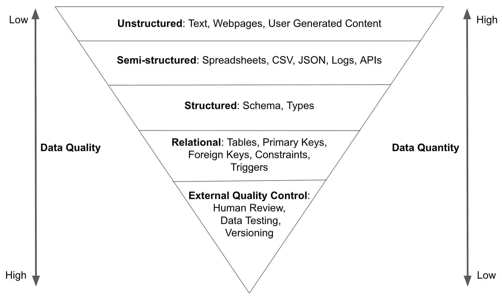

# **A Universe of Uses**
JZFS's versatility shines across different industries – making it the multi-purpose tool for the **data centric applications and teams**.

## Data Sharing
Git-style version control allows for decentralized, asynchronous collaboration. Every person gets their own copy of the dataset to read and write. JZFS allows you to coordinate collaboration over the internet with permissions, human review, forks and all the other distributed collaboration tools you are used to from GitHub.

Leveraging the Git model of code sharing which has scaled to thousands of contributors for open source software, JZFS solve the data sharing as below:
- Do you share data with customers?
- Do they ask you what changed between versions you share?
- Do they want to actively switch versions instead of having data change out from under them?
- Or, are customers or vendors sharing data with you?
- Are you having trouble maintaining quality of scraped data?
- When new data is shared or scraped, do downstream systems break?
- Would you like to see exactly what changed between data versions?
- Do you want to add automated testing to data shared with you?
- Would you like to instantly rollback to the previous version if tests fail?

JZFS is the best way to build DataHub to share data with customers or vendors.
- Customers: Use versions to satisfy both slow and fast upgrading consumers. Let your customers help make your data better. Versions offer better debugging information. Version X works but version Y doesn't. Your customers can even make changes and submit data patches for your review, much like open source.
- Vendors: When you receive data from a vendor, import the data into JZFS. Examine the diff, either with the human eye or programmatically, before putting the data into production. You can now build integration tests for vendor data. If there's a problem, never merge the import branch into main or roll the change back if a bug was discovered in production. Use the problematic diff to debug with your vendor. The same tools you have for software dependencies, you now have for data dependencies.

### Case Studies
Let us know if you would like us to feature your use of JZFS for data sharing here: info@gitdata.ai .

## Data and Model Quality Control 
Data Quality Control is a big, broad topic. Tim Sehn@Dolt presents a model for thinking about data quality.

This model divides data into quality levels based on its classification.      The further you travel down the inverted pyramid the higher quality the data.      Each level adds additional constraints to the data ensuring data quality.      Each level also requires more work, either by humans or software, reducing data quantity.

You want most humans consuming data in the form of metrics or dashboards from the human reviewed portion of the data pyramid.

High quality data takes effort.      You can make unstructured data semi-structured data by doing work.      You can make semi-structured data structured data by doing work.      And so on.

If you believe in the "Data is oil" analogy, improving data quality in this manner is **refining**.

Traditional databases were built for a world of transactions and reports.       External quality control had been the domain of the analysis function of the data organization. Humans produce reports or analyses using the data and uncover data quality issues in the process. They then either make a best effort patch of the data in the warehouse or try to root cause the problem in the pipeline and get it fixed in the data source.

Modern data science tools use data to create models that behave more like software than reports.      Models produce user visible outputs and define application behavior.      Tuning data to get the right model can be a lot like writing code.

Modern data science applications require model reproducibility, data quality, and multiple versions of data to perform at their best.      JZFS allows for these capabilities directly in your datasets, in a Git-style version control model most developers understand.

JZFS is used for model reproducibility. If you build a model from a version of the data, make a tag at that commit and refer to that tag in the model metadata.  It is common practice to store copies of training data or database backups in cloud storage for model reproducibility.      A full copy of the data is stored for every training run.      This can become quite expensive and limit the amount of models you can reproduce.      JZFS stores only the differences between stored versions decreasing the cost of data storage. Additionally, JZFS can produce diffs between versions of training data producing novel model insights.

JZFS is a new way to think about data quality control that adapts quality ideas, testing and versioning, from software development to data.    JZFS can be applied in your analytics function but also in your pipeline itself.    Moving data quality control upstream of analytics is a powerful idea. Just like agile software development made software development more efficient by moving software quality control closer to where code was generated, this new breed of data quality control tools allows you to move data quality control closer to where data is generated. JZFS is a complementary to traditional data quality control tools.    You can and should use both.    These tools can be deployed in multiple places in your data stack, preferably at all the entry and exit points from your warehouse or lake.

### **Defining artificial intelligence in the context of lineage**

Artificial intelligence (AI) is an umbrella term that covers a variety of techniques and approaches that make it possible for machines to learn, adjust and act with intelligence comparable to the natural intelligence of humans. Lineage has direct implications for many of the techniques and approaches of AI, such as:
- Neural networks. AI classifies data to make predictions and decisions in much the same way a human brain does. A neural network is a computing system made up of interconnected units (like neurons) that process data from external inputs, relaying information between each unit. The neural network requires multiple passes at the data to find connections and derive meaning from undefined data. Neural networks benefit greatly from the movement aspects of data lineage – because connecting those dots directs its search for meaning. 
- Natural language processing. AI that enables interaction, understanding and communication between humans and machines by analyzing and generating human language, including speech, is called natural language processing (NLP). NLP allows humans to communicate with computers using normal, everyday language to perform tasks. Natural language processing relies heavily on the human language data descriptions provided by the characteristics aspect of data lineage.
- Machine learning. AI that’s focused on giving machines access to data and letting them learn for themselves is known as machine learning. Machine learning automates analytical model building using methods from neural networks, statistics, operations research and physics – and it finds hidden insights in data without being explicitly programmed where to look or what to conclude. Machine learning delves into the relationships, processes and transformations aspects of data lineage during its undirected exploration of data’s potential.
- Deep learning. With deep learning, AI uses huge neural networks with many layers of processing to learn complex patterns in large amounts of data and perform humanlike tasks, such as recognizing speech or understanding images and videos (also known as computer vision). This method takes advantage of advances in computing power and improved training techniques. Deep learning depends on the users’ aspect of data lineage because its education is guided by analyzing how users interact with data.

## **Solving the Mysteries of Data Science’s Past and Present with Data Lineage**
- Data lineage is an essential aspect of data science and data analytics that enables organizations to understand the journey of data from its origin to its destination. It is a process of tracking the origin, movement, and transformation of data through various stages of its lifecycle. Data lineage plays a critical role in enhancing the performance and productivity of data science and analytics teams.
- By establishing a clear data lineage, data scientists and analysts can easily identify the source of data, its quality, and its dependencies. This information is crucial in ensuring data accuracy, reliability, and consistency. Additionally, data lineage helps teams quickly identify errors or issues in the data processing pipeline, enabling them to take corrective action promptly.
- Moreover, data lineage promotes better collaboration among team members by providing a shared understanding of the data ecosystem. This shared understanding ensures that everyone involved in the data analysis process is on the same page, reducing confusion and errors caused by miscommunication.

## **Enterprise DataHub & Data Collaboration**
Depending on your operating scale, you may even be managing multiple team members, who may be spread across different locations. JZFS enable Collaborative Datasets Version Management at Scale,Share & collaborate easily: Instantly share insights and co-edit with your team.

## **DataOps & Data Products & Data Mesh**
Augmenting Enterprise Data Development and Operations,JZFS ensures Responsible DataOps/AIOps/MLOps by improving Data Versioning, Provenance, and Reproducibility. JZFS makes a fusion of data science and product development and allows data to be containerized into shareable, tradeable, and trackable assets(data products or data NFTs). Versioning data products in a maturing Data Mesh environment via standard processes, data consumers can be informed about both breaking and non-breaking changes in a data product, as well as retirement of data products.

## **Industrial Digital Twin** 
Developing digital twins for manufacturing involves managing tons of large files and multiple iterations of a project. All of the data collected and created in the digital twin process (and there is a lot of it) needs to be managed carefully. JZFS allows you to manage changes to files over time and store these modifications in a database.

## **Data Lake Management**
Data lakes are dynamic. New files and new versions of existing files enter the lake at the ingestion stage. Additionally, extractors can evolve over time and generate new versions of raw data.   As a result, data lake versioning is a cross-cutting concern across all stages of a data lake.   Of course vanilla distributed file systems are not adequate for versioning-related operations.   For example, simply storing all versions may be too costly for large datasets, and without a good version manager, just using filenames to track versions can be error-prone.   In a data lake, for which there are usually many users, it is even more important to clearly maintain correct versions being used and evolving across different users.   Furthermore, as the number of versions increases, efficiently and cost-effectively providing storage and retrieval of versions is going to be an important feature of a successful data lake system.
