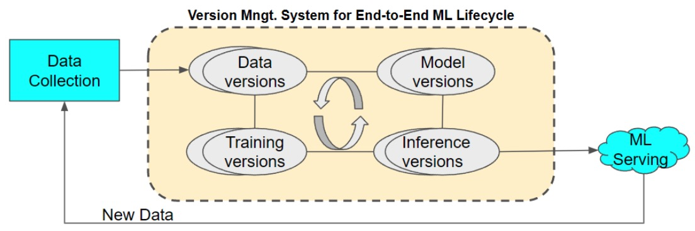
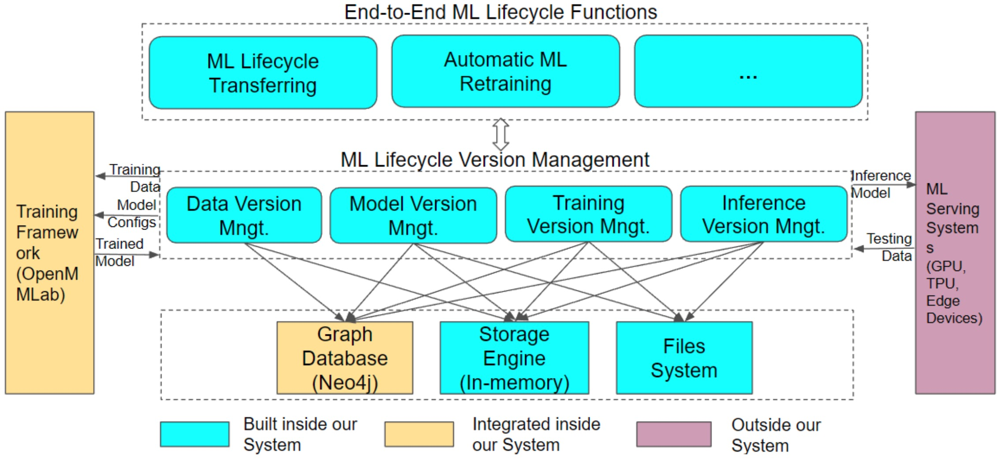
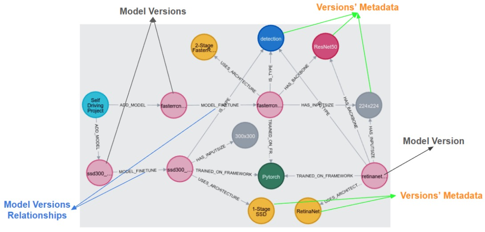

# VeML: An End-to-End Machine Learning Lifecycle for Large-scale and High-dimensional Data

## ABSTRACT

An end-to-end machine learning (ML) lifecycle consists of many iterative processes, from data preparation and ML model design to model training and then deploying the trained model for inference. When building an end-to-end lifecycle for an ML problem, many ML pipelines must be designed and executed that produce a huge number of lifecycle versions. Therefore, this paper introduces VeML, a Version management system dedicated to end-to-end ML Lifecycle. Our system tackles several crucial problems that other systems have not solved. First, we address the high cost of building an ML lifecycle, especially for large-scale and high-dimensional dataset. We solve this problem by proposing to transfer the lifecycle of similar datasets managed in our system to the new training data. We design an algorithm based on the core set to compute similarity for large-scale, high-dimensional data efficiently. Another critical issue is the model accuracy degradation by the difference between training data and testing data during the ML lifetime, which leads to lifecycle rebuild. Our system helps to detect this mismatch without getting labeled data from testing data and rebuild the ML lifecycle for a new data version. To demonstrate our contributions, we conduct experiments on real-world, large-scale datasets of driving images and spatiotemporal sensor data and show promising results.

端到端机器学习(ML)生命周期包括许多迭代过程：从数据准备、ML模型设计到模型训练，然后部署训练好的模型进行推理。  

在为ML问题构建端到端的生命周期时，必须设计和执行许多ML管道，这些管道会产生大量的生命周期版本。  

因此，本文介绍了VeML，一个致力于端到端机器学习生命周期的版本管理系统。  

我们的系统解决了其他系统没有解决的几个关键问题。  

首先，我们解决了构建机器学习生命周期的高成本问题，特别是对于大规模和高维数据集。我们通过提出将系统中管理的类似数据集的生命周期转移到新的训练数据来解决这个问题。为了高效地计算大规模、高维数据的相似度，我们设计了一种基于核心集的算法。  

另一个关键问题是，在机器学习生命周期中，训练数据和测试数据之间的差异会导致模型精度下降，从而导致生命周期重建。我们的系统帮助检测这种不匹配，而无需从测试数据中获取标记数据，并为新数据版本重建ML生命周期。  

为了证明我们的贡献，我们在真实世界的大规模驾驶图像和时空传感器数据集上进行了实验，并显示了有希望的结果。  


## Introduction

FIRSTLY, we try to answer the question: why do we need a version management system for the end-to-end ML lifecycle?  When building an end-to-end ML lifecycle, we need to deal with many possible choices for data preparation, ML algorithms, training hyper-parameters, and deployment configurations.  As a results, it costs huge time and computation to build an end-to-end ML lifecycle.  Moreover, the ML task continuously evolves throughout its lifetime that produces a a lot of lifecycle versions, from data versions to inference versions.  Therefore, we built our Version management system dedicated to the end-to-end ML lifecycle (VeML) to manage many ML lifecycle versions and leverage the stored versions for efficiently building a new ML lifecycle.  Figure 1 shows the data flow of our system from the data collection through our ML version management to model serving and go back with the new data.

首先，我们试图回答这个问题：为什么我们需要一个端到端ML生命周期的版本管理系统？  

在构建端到端的机器学习生命周期时，我们需要处理许多可能的选择，包括数据准备、机器学习算法、训练超参数和部署配置。因此，构建端到端的ML生命周期需要花费大量的时间和计算。  

此外，机器学习任务在其整个生命周期中不断发展，产生了许多生命周期版本，从数据版本到推理版本。  

因此，我们构建了专用于端到端机器学习生命周期(VeML)的版本管理系统，以管理许多机器学习生命周期版本，并利用存储的版本有效地构建新的机器学习生命周期。

图1显示了系统的数据流，从数据收集到ML版本管理，再到模型服务，然后返回新数据。



图1：端到端机器学习生命周期的版本管理系统数据流。

In this paper, we raise some crucial research questions for an end-to-end ML lifecycle management system that existing systems do not fully solve. We will show that our proposed VeML system can tackle these challenges in one unified system.

在本文中，我们为端到端机器学习生命周期管理系统提出了一些关键的研究问题，这些问题是现有系统无法完全解决的。我们将展示我们提出的VeML系统可以在一个统一的系统中解决这些挑战。

The first challenge for an ML lifecycle management system is how to manage a huge number of versions in an end-to-end ML lifecycle. Our system is built from ground on an internal in-memory storage engine for large-scale storage, integrating an enterprise-strength graph database like Neo4j [31] for graph-based lifecycle versions management, and a unified ML training framework, OpenMMLab, which supports from data preparation to model deployment [6].Therefore, our system can manage large-scale datasets and can support endto-end ML lifecycle versions, from data to inference versions.

机器学习生命周期管理系统的第一个挑战是如何在端到端机器学习生命周期中管理大量版本。我们的系统建立在一个内部内存存储引擎的基础上，用于大规模存储，集成了一个企业强度的图形数据库，如Neo4j[31]，用于基于图形的生命周期版本管理，以及一个统一的机器学习训练框架，OpenMMLab，它支持从数据准备到模型部署[6]。因此，我们的系统可以管理大规模的数据集，并且可以支持端到端的ML生命周期版本，从数据到推理版本。

The second challenge deals with the problem of how to leverage a large number of historic ML lifecycle versions to efficiently build an ML lifecycle for a new ML application. Especially, this challenge raises two research questions: How to save time and computation in building an ML pipeline for a new training dataset; and How to efficiently retrain for new unseen data during the ML lifecycle. We illustrate the huge cost of building an end-to-end ML lifecycle through the object detection problem, which is an important ML task for many real-world applications.

第二个挑战涉及如何利用大量历史ML生命周期版本来有效地为新的ML应用程序构建ML生命周期的问题。  

特别是，这一挑战提出了两个研究问题：如何在为新的训练数据集构建机器学习管道时节省时间和计算；以及如何在机器学习生命周期中有效地重新训练新的未见过的数据。我们通过对象检测问题说明了构建端到端机器学习生命周期的巨大成本，这是许多现实世界应用程序的重要机器学习任务。

The training dataset for an object detection problem is often in large-scale. For example, the detection COCO [27] dataset has more than 120K data samples with the data size is 21GB. The BDD100K [40] dataset for diverse driving has 100K object detection frames. To build an ML pipeline for a training data (e.g., COCO dataset), an ML engineer will need to try with many data transformation techniques, ML model algorithms, training hyper-parameters, and inference configurations to achieve the final target (e.g., the highest testing accuracy). We experimented with 4 Nvidia Titan GPUs, each with 24GB GPU memory, then the training time for just one ML pipeline is around 12 hours. The ML engineer can use some automated ML algorithms such as NAS-FCOS [43] to automatically find an ML pipeline, but the search cost for a training data is very high, 28 GPU-days, which is inefficient in production.

目标检测问题的训练数据集通常是大规模的。例如，检测COCO[27]数据集有120K多个数据样本，数据大小为21GB。用于多种驾驶的BDD100K[40]数据集具有100K个目标检测帧。为了为训练数据(例如COCO数据集)构建机器学习管道，机器学习工程师需要尝试许多数据转换技术、机器学习模型算法、训练超参数和推理配置，以实现最终目标(例如，最高的测试精度)。我们使用4个Nvidia Titan GPU进行实验，每个GPU内存为24GB，那么仅一个ML管道的训练时间就在12小时左右。机器学习工程师可以使用一些自动化的机器学习算法，如NAS-FCOS[43]来自动查找机器学习流水线，但是一个训练数据的搜索成本非常高，需要28个gpu天，在生产中效率很低。


Another case is the requirement to rebuild an ML lifecycle when the ML data continuously evolves when the ML problem runs in real-world. This situation is very common for object detection tasks in real-life applications like selfdriving car where the autonomous car must deal with new driving cases throughout its lifetime. Therefore, it raises a crucial research question about building a lifecycle for an ML problem: How can we leverage our VeML system to effectively and efficiently build an end-to-end ML lifecycle for (1) a new training dataset and (2) new testing data during the ML lifetime?

另一种情况是，当机器学习数据在现实世界中不断发展时，需要重新构建机器学习生命周期。这种情况在自动驾驶汽车等现实应用中的目标检测任务中非常常见，自动驾驶汽车必须在其整个生命周期中处理新的驾驶情况。因此，它提出了一个关于为机器学习问题构建生命周期的关键研究问题：我们如何利用我们的VeML系统在机器学习生命周期中有效和高效地为(1)新的训练数据集和(2)新的测试数据构建端到端的机器学习生命周期?

End-to-end ML lifecycle for a training dataset A training dataset will start a ML pipeline for a new ML problem. To quickly build a lifecycle for the ML problem, we propose the lifecycle transferring algorithm, which uses the dataset similarity to transfer lifecycle versions of similar datasets. Our solution is inspired by transfer learning methodology in which we can transfer the whole ML pipeline to a similar dataset to save training time but still get high performance.

训练数据集将为一个新的机器学习问题启动一个机器学习管道。为了快速构建ML问题的生命周期，我们提出了生命周期转移算法，该算法使用数据集相似度来转移相似数据集的生命周期版本。我们的解决方案受到迁移学习方法的启发，在这种方法中，我们可以将整个ML管道转移到类似的数据集上，以节省训练时间，但仍然可以获得高性能。


The challenge is to efficiently compute dataset similarity for large-scale, high-dimensional data. ML datasets are often high dimensions (e.g., 1280x720 image data) and consist of large samples (e.g., COCO, BDD datasets have more than 100K examples). Thus, it is very inefficient to compute dataset similarity using all data samples of each dataset. To solve it, we propose representing each dataset as a small core set that can cover its distribution to efficiently compute similarity for each pair of datasets in the VeML system.

挑战在于如何有效地计算大规模、高维数据的数据集相似度。机器学习数据集通常是高维的(例如，1280x720图像数据)，并且由大样本组成(例如，COCO, BDD数据集有超过10万个样本)。因此，使用每个数据集的所有数据样本来计算数据集相似度是非常低效的。为了解决这个问题，我们提出将每个数据集表示为一个可以覆盖其分布的小核心集，以有效地计算VeML系统中每对数据集的相似度。

End-to-end ML lifecycle for new testing data A new testing data is a collection of unseen data samples when the ML problem runs in the real-world production. As a result, new testing data continuously come during the ML lifetime. A drift testing data is a data version that causes the (deployed) model accuracy significantly drops. The drift testing data version is derived from a different distribution than the training data version. If the testing and training data version are drawn from the same data distribution, no model accuracy degradation occurs; thus, the ML lifecycle remains. On the other hand, retraining is needed, then we need to construct a new ML lifecycle for the new testing data version.

新测试数据的端到端机器学习生命周期当机器学习问题在实际生产中运行时，新的测试数据是一组看不见的数据样本。因此，在机器学习的生命周期中，新的测试数据不断出现。漂移测试数据是导致(部署的)模型精度显著下降的数据版本。漂移测试数据版本来自与训练数据版本不同的分布。如果测试数据版本和训练数据版本来自相同的数据分布，则不会发生模型精度下降;因此，ML生命周期仍然存在。另一方面，需要重新训练，然后我们需要为新的测试数据版本构建新的ML生命周期。

In this paper, we propose to compare the core set of both testing and training data versions to detect data distribution mismatch without getting labeled test data, which is human cost saving. The next challenge is how to efficiently rebuild an ML lifecycle for a new testing data version in the case of the data distribution difference. We achieve this by allowing ML engineers to choose from various incremental training methods and VeML will automatically rebuild a new ML lifecycle after that.

在本文中，我们提出通过比较测试和训练数据版本的核心集来检测数据分布不匹配，而不需要标记测试数据，从而节省人力成本。下一个挑战是如何在数据分布差异的情况下为新的测试数据版本有效地重建ML生命周期。我们通过允许机器学习工程师从各种增量训练方法中进行选择来实现这一点，VeML将在此之后自动重建新的机器学习生命周期。

In summary, we present our contributions for this research as follows:
综上所述，我们在本研究中的贡献如下: 

• We build a version management system dedicated to end-to-end ML lifecycle (VeML), from data to inference. Our system implements numerous functionalities to help manage huge ML lifecycle versions.
我们建立了一个版本管理系统，致力于端到端的机器学习生命周期(VeML)，从数据到推理。我们的系统实现了许多功能来帮助管理巨大的ML生命周期版本。

• We propose an algorithm based on the core set to efficient comparing large-scale and high-dimensional data versions. We prove our solution on large-scale driving images and spatiotemporal sensor datasets.
我们提出了一种基于核心集的算法，以有效地比较大规模和高维数据版本。我们在大规模驾驶图像和时空传感器数据集上证明了我们的解决方案。

• Using dataset similarity computation, our system can transfer lifecycle versions of similar datasets to effectively and efficiently build an ML lifecycle for a new ML problem.
使用数据集相似度计算，我们的系统可以转移类似数据集的生命周期版本，从而有效地为新的机器学习问题构建机器学习生命周期。

• We employ the core set computation to detect data distributions dissimilarity between the testing and training data versions without getting labeled data. Based on the unsupervised data distribution mismatch detection, VeML can support automatically rebuild a ML lifecycle after choosing a model retraining method.
我们使用核心集计算来检测测试和训练数据版本之间的数据分布差异，而不需要标记数据。基于无监督数据分布不匹配检测，VeML支持在选择模型再训练方法后自动重建机器学习生命周期。

• Moreover, to demonstrate that our system is helpful, we show how VeML is using in an on-going self-driving project and how it supports new challenges in ML lifecycle.
此外，为了证明我们的系统是有用的，我们展示了VeML如何在正在进行的自动驾驶项目中使用，以及它如何支持机器学习生命周期中的新挑战。


The rest of this paper is structured as follows.
本文的其余部分结构如下。

Section 2 presents related research to our work.
第2节介绍了我们工作的相关研究。

Section 3 describes our system architecture and functionalities in detail.
第3节详细描述了我们的系统架构和功能。

Section 4 presents how to transfer ML lifecycle versions for a new training dataset.
第4节介绍了如何为新的训练数据集转移ML生命周期版本。

Next, section 5 shows how to detect data distribution mismatch and rebuild a new ML lifecycle.
接下来，第5节将展示如何检测数据分布不匹配并重新构建新的ML生命周期。

Then, section 6 demonstrates the usefulness of our VeML system.
然后，第6节将演示我们的VeML系统的有用性。

And finally, section 7 wraps up our contributions and discusses future work.
最后，第7节总结了我们的贡献并讨论了未来的工作。

## II.RELATED WORK

This section discusses related research in ML lifecycle platforms, version control systems, and ML automation which directly connects to our research.        We also survey papers tackling data-related challenges, such as dataset similarity, data drift detection, and incremental training with new data.

本节讨论与我们的研究直接相关的机器学习生命周期平台、版本控制系统和机器学习自动化方面的相关研究。我们还调查了处理数据相关挑战的论文，如数据集相似性、数据漂移检测和新数据的增量训练。

ML Lifecycle Platforms Many ML lifecycle platforms have been proposed to support ML tasks in production.        One of the first such systems is Google Tensorflow Extended (TFX) [20], which has been introduced since 2017.        TFX is a TensorFlow-based ML platform, from data preparation to model training and production serving.        The versioning information is managed by a metadata tool and can be saved to a database like SQLite or MySQL.        MLFlow [41] was presented by DataBricks, the company behind the large-scale data analysis Apache Spark, in 2018.        MLFlow is an open-source platform that supports packaging and tracking ML experiments runs and reproducing.        It manages ML experiment versions in artifact concepts, such as data files, models, and training codes.        Data platform for ML (MLdp) [1] was introduced as an internal platform by Apple in 2019.        It has an integrated data system, supports data versioning, and integrates with inhouse solutions for model training and deployment.

许多机器学习生命周期平台被提出来支持生产中的机器学习任务。首批这样的系统之一是Google Tensorflow Extended (TFX)[20]，该系统于2017年推出。TFX是一个基于tensorflow的机器学习平台，从数据准备到模型培训和生产服务。版本控制信息由元数据工具管理，可以保存到SQLite或MySQL等数据库中。MLFlow[41]于2018年由DataBricks(大型数据分析Apache Spark背后的公司)提出。MLFlow是一个支持打包和跟踪ML实验运行和重现的开源平台。它管理工件概念中的ML实验版本，例如数据文件、模型和训练代码。ML数据平台(Data platform for ML, MLdp)[1]是苹果公司在2019年推出的内部平台。它有一个集成的数据系统，支持数据版本控制，并集成了用于模型训练和部署的内部解决方案。

我们是否首先支持tfx？ 需要先找到客户。

TFX: A TensorFlow-Based Production-Scale Machine Learning Platform
https://dl.acm.org/doi/pdf/10.1145/3097983.3098021

tensorflow/tensorflow: An Open Source Machine Learning Framework for Everyone
https://github.com/tensorflow/tensorflow

arXiv - Towards ML Engineering - A Brief History Of TensorFlow Extended (TFX)
https://arxiv.org/pdf/2010.02013.pdf

Continuous Training and Deployment of Deep Learning Models | Datenbank-Spektrum
https://link.springer.com/article/10.1007/s13222-021-00386-8

Arangopipe, a tool for machine learning meta-data management - IOS Press
https://content.iospress.com/articles/data-science/ds210034

Arangopipe, a tool for machine learning meta-data management
https://content.iospress.com/download/data-science/ds210034?id=data-science%2Fds210034

arangodb/arangodb: 🥑 ArangoDB is a native multi-model database with flexible data models for documents, graphs, and key-values. Build high performance applications using a convenient SQL-like query language or JavaScript extensions.
https://github.com/arangodb/arangodb

Efficient ML Lifecycle Transferring for Large-Scale and High-Dimensional Data via Core Set-Based Dataset Similarity | IEEE Journals & Magazine | IEEE Xplore
https://ieeexplore.ieee.org/document/10185033

IEEE Xplore Full-Text PDF:
https://ieeexplore.ieee.org/stamp/stamp.jsp?tp=&arnumber=10185033

arXiv - Towards ML Engineering - A Brief History Of TensorFlow Extended (TFX)
https://arxiv.org/pdf/2010.02013.pdf

Collaborative Machine Learning Model Building with Families Using Co-ML
https://arxiv.org/pdf/2304.05444.pdf

Dataset and Network Introspection ToolKit (DNIKit) - Apple Machine Learning Research
https://machinelearning.apple.com/research/dnikit

Apple
https://github.com/apple?q=&type=all&language=&sort=

Saga: A Platform for Continuous Construction and Serving of Knowledge At Scale
https://arxiv.org/pdf/2204.07309.pdf

1909.05372.pdf
https://arxiv.org/pdf/1909.05372.pdf

Data Platform for Machine Learning - Apple Machine Learning Research
https://machinelearning.apple.com/research/data-platform-machine-learning

Data Platform for Machine Learning
https://dl.acm.org/doi/pdf/10.1145/3299869.3314050

Architectural Components in ML-Enabled Systems | by Christian Kästner | Medium
https://ckaestne.medium.com/architectural-components-in-ml-enabled-systems-78cf76b29a92

Christian Kästner – Medium
https://ckaestne.medium.com/

Security and Privacy in ML-Enabled Systems | by Christian Kästner | Medium
https://ckaestne.medium.com/security-and-privacy-in-ml-enabled-systems-1855f561b894

生产中的机器学习：从模型到产品 | 作者：克里斯蒂安·卡斯特纳 中等的
https://ckaestne.medium.com/machine-learning-in-production-book-overview-63be62393581

Machine Learning in Production / AI Engineering
https://ckaestne.github.io/seai/

``Everyone wants to do the model work, not the data work'': Data Cascades in High-Stakes AI
https://storage.googleapis.com/pub-tools-public-publication-data/pdf/0d556e45afc54afeb2eb6b51a9bc1827b9961ff4.pdf

Collaboration Challenges in Building ML-Enabled Systems: Communication, Documentation, Engineering, and Process
https://arxiv.org/pdf/2110.10234.pdf

2105.12422.pdf
https://arxiv.org/pdf/2105.12422.pdf

Actionable Data Insights for Machine Learning
https://dl.acm.org/doi/pdf/10.1145/3578356.3592581

ieee_mlflow.pdf
https://people.eecs.berkeley.edu/~matei/papers/2018/ieee_mlflow.pdf

Developments in MLflow: A System to Accelerate the Machine Learning Lifecycle
https://people.eecs.berkeley.edu/~matei/papers/2020/deem_mlflow.pdf

In general, these ML lifecycle platforms do not have endto-end ML lifecycle version management, from data to inference.        In the case of TFX, it supports end-to-end ML lifecycle but does not help build a new ML lifecycle employing managed lifecycle versions as our system.

一般来说，这些机器学习生命周期平台没有端到端的机器学习生命周期版本管理，从数据到推理。在TFX的情况下，它支持端到端的机器学习生命周期，但不帮助构建一个新的机器学习生命周期，使用管理生命周期版本作为我们的系统。

```我想这里是我们的机会 ```

Recently, MLOps for end-to-end ML lifecycle are emerging.        They are provided by many big companies such as Google Cloud [21], Amazon Sagemaker [3], and Microsoft Azure [4].        These systems support data scientists building endto-end ML problems, from data to deployment, but still do not leverage many lifecycle versions to quickly construct a lifecycle for an ML problem.

最近，端到端ML生命周期的mlop正在出现。它们由许多大公司提供，如Google Cloud[21]、Amazon Sagemaker[3]和Microsoft Azure[4]。这些系统支持数据科学家构建端到端机器学习问题，从数据到部署，但仍然没有利用许多生命周期版本来快速构建机器学习问题的生命周期。

2111.13657.pdf
https://arxiv.org/pdf/2111.13657.pdf

Amazon SageMaker Debugger: A System for Real-Time Insights into Machine Learning Model Training
https://assets.amazon.science/0b/cb/47bb9a1e4b6a8f78ed7a7611f4a7/amazon-sagemaker-debugger-a-system-for-real-time-insights-into-machine-learning-model-training.pdf

Amazon SageMaker Autopilot: a white box AutoML solution at scale
https://arxiv.org/pdf/2012.08483.pdf

Amazon SageMaker Model Parallelism: A General and Flexible Framework for Large Model Training
https://arxiv.org/pdf/2111.05972.pdf

Elastic Machine Learning Algorithms in Amazon SageMaker
https://edoliberty.github.io/papers/sagemaker.pdf

Version Management for ML With the increasing importance of ML versioning management, many solutions have been introduced for ML version control, especially for data versions.        Typically, datasets for ML tasks are stored in file systems, causing managing many versions of them difficult and inefficient.

ML的版本管理随着ML版本管理的重要性日益增加，已经为ML版本控制引入了许多解决方案，特别是数据版本控制。通常，ML任务的数据集存储在文件系统中，这导致管理多个版本的数据集变得困难且效率低下。

Paper [18] proposed to build a data version management system over a relational database.        Their solution was to separate the data from the version information in two tables.        The data table stores the records are appearing in any data version, while the version table captures the versioning information of which version contains which records.        They presented the partitioning optimization problem, given a version-record bipartite graph, minimizing the checkout and storage cost, which is an NP-hard problem.

文献[18]提出在关系数据库上构建数据版本管理系统。他们的解决方案是在两个表中将数据与版本信息分开。数据表存储出现在任何数据版本中的记录，而版本表捕获哪个版本包含哪些记录的版本控制信息。他们提出了分区优化问题，给定一个版本记录二部图，最小化结帐和存储成本，这是一个np困难问题。

1703.02475.pdf
https://arxiv.org/pdf/1703.02475.pdf

orpheus.pdf
https://people.eecs.berkeley.edu/~adityagp/papers/orpheus.pdf

Our data version management also bases on this idea by separating the data and version storage.        We save data samples into in-memory storage but manage the version information in a graph database.        Our solution may not optimize the storage cost, but it helps us to load any data versions constantly, which is critical for reproducing any ML training processes during an ML lifecycle.

我们的数据版本管理也基于这个想法，将数据和版本存储分开。我们将数据样本保存到内存存储中，但在图形数据库中管理版本信息。我们的解决方案可能无法优化存储成本，但它可以帮助我们不断加载任何数据版本，这对于在机器学习生命周期中重现任何机器学习训练过程至关重要。

Moreover, many systems and tools have been proposed to manage data and model versions for the ML lifecycle.        For instance, Data Version Control (DVC) [19] is a popular opensource tool.        DVC lets us capture versions of data and models in Git commits while storing them on-premises or in the cloud.        However, no systems supports us in managing end-toend ML lifecycle versions and leveraging managed versions to build a new ML lifecycle.

此外，已经提出了许多系统和工具来管理ML生命周期的数据和模型版本。例如，数据版本控制(DVC)[19]是一个流行的开源工具。DVC允许我们在Git提交中捕获数据和模型的版本，同时将它们存储在本地或云中。然而，没有系统支持我们管理端到端机器学习生命周期版本，并利用已管理的版本来构建新的机器学习生命周期。

ML Automation There are a number of systems that serves automatic searching for the best ML model such as AutoML systems for ML [12], [16], [32] or NAS systems [42] for deep learning (DL) problems.      These systems search for ML/DL pipelines from a set of predefined ML/DL operators and then execute experiments with many training hyperparameter combinations.      They also leverage similar datasets as a meta-learning approach for more efficient ML pipeline exploration [12], [16].

有许多系统提供自动搜索最佳ML模型的服务，例如用于ML[12]、[16]、[32]的AutoML系统或用于深度学习(DL)问题的NAS系统[42]。这些系统从一组预定义的ML/DL操作符中搜索ML/DL管道，然后使用许多训练超参数组合执行实验。他们还利用类似的数据集作为元学习方法，用于更有效的机器学习管道探索[12]，[16]。

The most dissimilarity of these systems to ours is that they search for an ML pipeline for each new dataset, which is time-consuming and high-cost.      On the other hand, our system leverages many ML lifecycle versions to effectively and efficiently build new lifecycle for training data and testing data versions.    

这些系统与我们的系统最大的不同之处在于，它们为每个新数据集搜索ML管道，这是耗时且高成本的。另一方面，我们的系统利用许多机器学习生命周期版本来有效和高效地为训练数据和测试数据版本构建新的生命周期。

Dataset Similarity
To compute dataset similarity, metafeatures based computation is one of the most popular solutions [12].   However, meta-features are often unavailable for high-dimensional data such as image or spatiotemporal data.   Using dataset embedding [15] for dataset similarity computation is also a common method, but it is inefficient when computing with a large number of data samples.

数据集相似
为了计算数据集相似度，基于元特征的计算是最流行的解决方案之一[12]。然而，元特征通常无法用于高维数据，如图像或时空数据。使用数据集嵌入[15]进行数据集相似度计算也是一种常用的方法，但在计算大量数据样本时效率低下。

Another recent proposal is computing geometric dataset distances based on optimal transport [2].   This method worked for classification datasets but still suffered the high-cost problem when dealing with large-scale datasets.   Our similarity computation is based on the core set, a small subset of a dataset, and thus, possible to work with large-scale and highdimensional datasets.

最近的另一个建议是基于最优传输计算几何数据集距离[2]。该方法适用于分类数据集，但在处理大规模数据集时仍然存在高成本问题。我们的相似性计算基于核心集，即数据集的一个小子集，因此可以处理大规模和高维数据集

Data Drift Detection

数据漂移检测

Detecting drift in the continuous data has been tackled in some papers [28], [37].   Matchmaker [28] uses a decision tree to detect both data drift and concept drift, but it only works well for tabular data.   ODIN [37] detects drift in video image data, but it still uses all data samples that may not be efficient for massive datasets.   Our solution is based on the small core set that can work for unlabeled continuing large-scale data versions.

一些论文已经对连续数据的漂移检测进行了研究[28]，[37]。Matchmaker[28]使用决策树来检测数据漂移和概念漂移，但它只适用于表格数据。ODIN[37]检测视频图像数据中的漂移，但它仍然使用所有的数据样本，这对于海量数据集来说可能不是很有效。我们的解决方案基于小型核心集，可以用于未标记的连续大规模数据版本。

Incremental Learning

增量学习

continuously retrain an ML model when a new training data comes.   Some popular model retraining methods are full training which retrains all available datasets, and transfer learning which only retrains the new dataset from a pre-trained model.   These approaches require labeling all available data samples, which is costly.   Other incremental learning algorithms, that reduce labeling cost, are active learning [35], [36], which tries to label a small number of the most significant training data, and domain adaptation [7], [22], [38], which learns from a source domain but can generalize to a different target domain without labeled data.

当有新的训练数据出现时，不断地重新训练ML模型。一些流行的模型再训练方法是完全训练，它重新训练所有可用的数据集，以及迁移学习，它只从预训练的模型中重新训练新的数据集。这些方法需要标记所有可用的数据样本，这是昂贵的。其他减少标记成本的增量学习算法有主动学习[35]，[36]，它试图标记少量最重要的训练数据，以及域适应[7]，[22]，[38]，它从源域学习，但可以在没有标记数据的情况下推广到不同的目标域。

## III. SYSTEM ARCHITECTURE AND FUNCTIONALITIES 系统架构和功能

#### A. SYSTEM ARCHITECTURE  系统架构

Our system architecture has three main blocks and other functional modules. The first is an in-memory storage engine built in our laboratory to manage large-scale data versions, training logs, and metadata information. The second is an integrated graph database such as Neo4j [31] for graph-based ML lifecycle version management and analysis. And the third component is an ML training framework which is built over the open-source OpenMMLab [6].

我们的系统架构有三个主要模块和其他功能模块。第一个是我们实验室构建的内存存储引擎，用于管理大规模数据版本、训练日志和元数据信息。第二种是集成的图形数据库，如Neo4j[31]，用于基于图形的ML生命周期版本管理和分析。第三个组件是基于开源OpenMMLab构建的ML训练框架[6]。

OpenMMLab is a unified architecture for many ML problems, integrating with common ML frameworks (like PyTorch [33]), easy to re-use and extend functions by a modular design. We leverage the OpenMMLab framework to perform ML training with training data from a data version, model algorithm configurations from a model version, and return trained model checkpoints for a training version. It also supports model deployment to an inference model running in ML serving systems. Figure 2 shows our system architecture with three main components and many functional modules. We use file systems to save binary objects like trained and deployed models.

OpenMMLab是解决许多机器学习问题的统一架构，与常见的机器学习框架(如PyTorch[33])集成，通过模块化设计易于重用和扩展功能。我们利用OpenMMLab框架使用来自数据版本的训练数据、来自模型版本的模型算法配置执行ML训练，并返回训练版本的训练模型检查点。它还支持将模型部署到在ML服务系统中运行的推理模型。图2显示了我们的系统架构，包括三个主要组件和许多功能模块。我们使用文件系统来保存二进制对象，如训练和部署的模型。


#### B. SYSTEM FUNCTIONALITIES 系统功能

Firstly, we define how we manage the version of every component in the end-to-end ML lifecycle. A data version is a collection of data samples and its data preparation (e.g., normalization, missing values imputation). A training data version is a data version that is used as the training data for the ML task. A testing data version is a data version that contains the unseen new data collected from the real-world environment when an ML problem runs in production. The unseen test data will be annotated and routed back as training data when rebuilding the ML lifecycle.

首先，我们定义了如何管理端到端ML生命周期中每个组件的版本。数据版本是数据样本及其数据准备的集合(例如，归一化，缺失值输入)。训练数据版本是用作ML任务的训练数据的数据版本。测试数据版本是一个数据版本，其中包含在生产环境中运行ML问题时从实际环境中收集的未见过的新数据。在重建机器学习生命周期时，不可见的测试数据将作为训练数据进行注释和路由。

A model version includes a specific ML algorithm (e.g., features transformation, model architecture) to learn from the training data. Different model versions can share some common model structure such as the same model backbone in many object detection algorithms. A training version maintains a set of training hyper-parameters used to optimize the ML model, the training logs, and the trained model. An inference version consists of deployment configurations (e.g., quantization algorithm, inference device) and the deployed model.

模型版本包括从训练数据中学习的特定ML算法(例如，特征转换，模型架构)。在许多目标检测算法中，不同的模型版本可以共享一些共同的模型结构，例如相同的模型主干。训练版本维护一组训练超参数，用于优化机器学习模型、训练日志和训练模型。推理版本由部署配置(例如，量化算法、推理设备)和部署模型组成。

The core functionality of our system is the ML lifecycle version management that contains some modules, as shown in figure 2. The data version management component uses our built in-memory storage engine that can support multiple data types in a unified system, like tabular, image, and graph data. It can filter, update, add, and merge any data versions. It also supports data versions visualization and statistic functions. The model version module governs various ML model algorithms as metadata such as model backbone (e.g. ResNet50 [14]), ML architecture (e.g. FasterRCNN [34]), and so on. Thus, it provides a model versions comparison function by comparing the metadata of different ML models.

我们系统的核心功能是包含一些模块的ML生命周期版本管理，如图2所示。数据版本管理组件使用我们内置的内存存储引擎，该引擎可以在一个统一的系统中支持多种数据类型，如表格、图像和图形数据。它可以过滤、更新、添加和合并任何数据版本。它还支持数据版本可视化和统计功能。模型版本模块将各种ML模型算法作为元数据进行管理，例如模型主干(例如ResNet50[14])、ML架构(例如FasterRCNN[34])等。因此，它通过比较不同ML模型的元数据提供了模型版本比较功能。



图二：系统架构和功能  

The training version management module maintains training hyper-parameters, training logs, and the trained model of each training experiment. It provides training versions visualization and training error analysis functions. The inference version component manages deployment configurations and the deployed model of an inference version. It helps to analyze prediction errors by visualizing inference versions on real-world testing data.

训练版本管理模块维护训练超参数、训练日志和每个训练实验的训练模型。提供了训练版本可视化和训练误差分析功能。推论版本组件管理推论版本的部署配置和已部署模型。它通过可视化真实测试数据上的推理版本来帮助分析预测错误。

Each version management module supplies an application programming interface (API) that accepts a version value and returns the data and metadata information maintained by that component. Therefore, we can build end-to-end ML lifecycle functions over our version management using their APIs (see figure 2). This research introduces our implementation for two functions: ML lifecycle transferring and automatic ML lifecycle rebuilding.

每个版本管理模块提供一个应用程序编程接口(API)，该接口接受版本值并返回由该组件维护的数据和元数据信息。因此，我们可以使用他们的api在我们的版本管理上构建端到端的机器学习生命周期功能(见图2)。本研究介绍了我们对两个功能的实现：机器学习生命周期转移和机器学习生命周期自动重建。

Firstly, we implement the ML lifecycle transferring function by reusing each lifecycle version, from model to inference, for new training data. Thanks to the APIs of each version management module, it is easy to get each version’s data and information and transfer them for the new lifecycle.

首先，我们通过重用从模型到推理的每个生命周期版本来实现ML生命周期传递函数，用于新的训练数据。由于每个版本管理模块的API，可以很容易地获取每个版本的数据和信息，并将其传输到新的生命周期。

Secondly, the automatic ML lifecycle rebuilding function is performed by implementing incremental learning methods on the previous lifecycle version. For example, in the full training method, we merge the new testing data version with the previous training data version to be full training data (thanks to our data version management). Then we can reuse the previous model and training versions to train on new training data for a new ML lifecycle.

其次，通过在之前的生命周期版本上实现增量学习方法，实现ML生命周期的自动重建功能。例如，在完整训练方法中，我们将新的测试数据版本与以前的训练数据版本合并为完整的训练数据(感谢我们的数据版本管理)。然后我们可以重用以前的模型和训练版本，为新的ML生命周期训练新的训练数据。


C. SYSTEM IMPLEMENTATION

Our critical objective is to manage all the data and training logs for numerous end-to-end ML lifecycle versions. We store the data samples, training logs, and other management information in our in-memory storage engine as insertedonly tables without deletion or modification operations. This implementation makes it easier to manage and faster to select. Particularly, we store data records of each data version in one consecutive range of storage that helps to retrieve any data version constantly, which is a benefit for reproducing a training experiment at any time in the ML lifecycle.

我们的关键目标是管理众多端到端ML生命周期版本的所有数据和训练日志。我们将数据样本、训练日志和其他管理信息存储在内存存储引擎中，作为只插入的表，不进行删除或修改操作。这种实现使它更容易管理和更快地选择。特别是，我们将每个数据版本的数据记录存储在一个连续的存储范围中，这有助于不断检索任何数据版本，这对于在ML生命周期中的任何时间复制训练实验都是有益的。

Data samples and annotations are stored separately in different tables linked by data samples identifications (data IDs) which are indexed. Thus, it is flexible to manage various types of annotations, such as classes, bounding boxes, segmentation, skeletons, or adding a new one.

数据样本和注释分别存储在通过索引的数据样本标识(数据id)链接的不同表中。因此，它可以灵活地管理各种类型的注释，例如类、边界框、分割、骨架或添加新注释。

Versioning information of a data version is organized in the graph-based schema, with each version being a node in the graph. The set of data IDs for a data version is directly stored in each node, which helps us easily extend or merge any data versions by adding or joining some sets of data IDs.

数据版本的版本信息组织在基于图的模式中，每个版本是图中的一个节点。数据版本的数据id集直接存储在每个节点中，这有助于我们通过添加或连接一些数据id集轻松扩展或合并任何数据版本。

Moreover, ML configurations like model algorithms and training hyper-parameters are represented as metadata nodes in the graph. All ML versions, like model, training, and inference versions, are also managed in the graph. An ML version with a relationship with each other, such as a model version that is fine-tuned from other model versions, can be denoted as links in our graph management.

此外，像模型算法和训练超参数这样的机器学习配置被表示为图中的元数据节点。所有ML版本，如模型、训练和推理版本，也在图中进行管理。具有相互关系的ML版本，例如从其他模型版本微调的模型版本，可以在我们的图管理中表示为链接。

Figure 3 illustrates how we organize model versions, model metadata, and their relationships in graph-based management. Using graph representation, we can easily inspect an ML lifecycle through any ML version (data to inference) and at any time.

图3说明了我们如何在基于图的管理中组织模型版本、模型元数据以及它们之间的关系。使用图表示，我们可以在任何时间通过任何ML版本(从数据到推理)轻松地检查ML生命周期。



图3：系统中模型版本和模型元数据（基于图的管理）。

